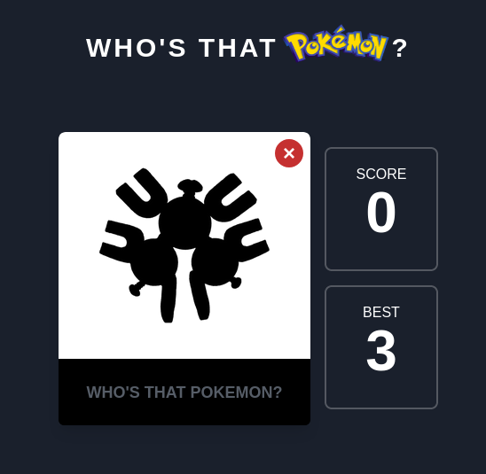

# **Who's that Pokémon?**
*Gotta guess'em all at https://whos-that-pokemon.vercel.app*

This is a React-made project based on the Pokémon trivia *"Who's that Pokémon?"*. First release has all the first 151 Pokémons from Kanto/Indigo league. 

## **Tools used for this**
- [Create React App](https://github.com/facebook/create-react-app) w/ Hooks
- [Tailwind CSS](https://github.com/tailwindlabs/tailwindcss)
- consuming [PokeAPI.co](https://github.com/PokeAPI/pokeapi) (a Pokémon API)
- plain CSS3 for animations

## **WIP implementations**

- [ ] useContext application
- [ ] set levels (easy, medium and hard)
- [ ] add more leagues